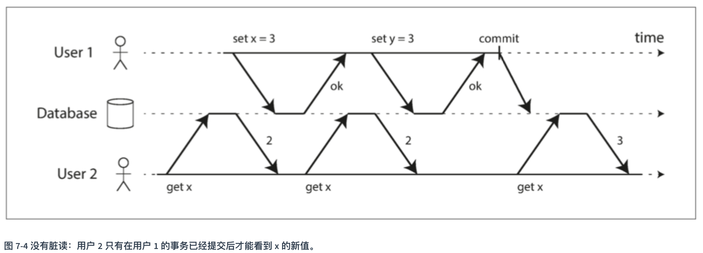

# mysql中日志区分

## redo log
作用
确保事务的持久性。redo日志记录事务执行后的状态，用来恢复未写入data file的已成功事务更新的数据。防止在发生故障的时间点，尚有脏页未写入磁盘，在重启mysql服务的时候，根据redo log进行重做，从而达到事务的持久性这一特性。

## undo log
作用
保证数据的原子性，保存了事务发生之前的数据的一个版本，可以用于回滚，同时可以提供多版本并发控制下的读（MVCC），也即非锁定读。

## bin log
作用
用于复制，在主从复制中，从库利用主库上的binlog进行重播，实现主从同步。
用于数据库的基于时间点的还原。

https://blog.csdn.net/liwenxia626/article/details/112299134

## 脏读和脏写

脏读：在 读已提交 隔离级别运行的事务必须防止脏读。
脏写；对于写入的每个对象，数据库都会记住旧的已提交值，和由当前持有写入锁的事务设置的新值。当事务正在进行时，任何其他读取对象的事务都会拿到旧值。 只有当新值提交后，事务才会切换到读取新值。
